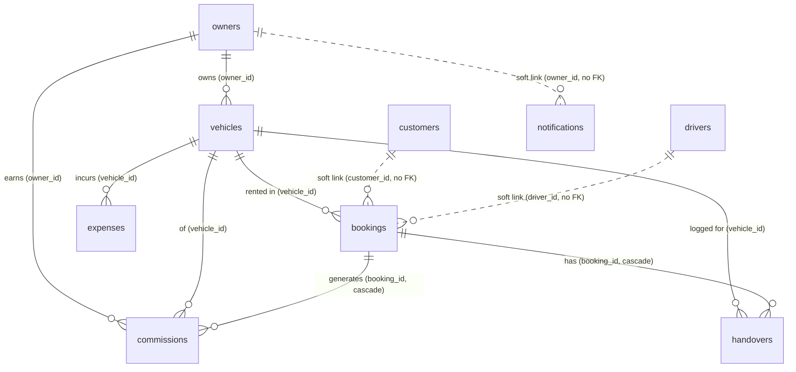

# EMRAC — Backend Documentation

The backend is **Supabase** (Postgres + Realtime + Edge Functions). The React app
works fully offline on `localStorage`; when Supabase env vars are present it also
**syncs every write** to Postgres and **hydrates from it on load**, so multiple
devices share data and the scheduled SMS jobs have something to read.

- **DB:** Postgres (Supabase)
- **Access layer:** [src/lib/db.ts](../src/lib/db.ts) — maps DB rows (`snake_case`) ↔ TS types (`camelCase`)
- **Toggle:** [src/lib/supabase.ts](../src/lib/supabase.ts) — `supabaseEnabled` is true when `VITE_SUPABASE_URL` + `VITE_SUPABASE_ANON_KEY` are set
- **Writes:** each store action calls `sync(() => db.xxx())` (no-op when Supabase off)
- **Reads:** `dbFetchAll()` on app boot (`loadAll`) + Realtime re-fetch on any change ([src/lib/realtime.ts](../src/lib/realtime.ts))

---

## 1. Setup order (run once)

Run these in the **Supabase SQL Editor**, in order:

1. **`schema.sql`** — all core tables, RLS off, realtime publication.
2. **`sms-setup.sql`** — `sms_log`, `sms_opt_out`, consent columns, booking referral columns.
3. **`seed.sql`** — optional demo data (owners, vehicles, bookings, …).

Then deploy the Edge Functions and configure secrets/cron/webhooks — see §6–§8.

Frontend env (`.env.local`):
```
VITE_SUPABASE_URL=https://<project-ref>.supabase.co
VITE_SUPABASE_ANON_KEY=<anon/publishable key>
VITE_ADMIN_PHONE=94XXXXXXXXX        # receives admin SMS alerts
```

---

## 2. Entity-relationship overview



**Hard foreign keys** (enforced in Postgres): vehicles→owners, bookings→vehicles,
expenses→vehicles, commissions→bookings/vehicles/owners, handovers→bookings/vehicles.

**Soft links** (plain `text` columns, joined in app code, *not* FK-constrained):
- `bookings.customer_id` → `customers.id`
- `bookings.driver_id` → `drivers.id`
- `notifications.owner_id` → `owners.id`
- `bookings.referral` / `commissions.referral` / `inquiries.referral` → **a name string**; when it equals an `owners.name` the referrer is that owner (see §5).

> **Why text PKs?** IDs are generated client-side (`uid()`), so every PK is `text`
> and `created_at` is stored as a `text` ISO string. Inserts carry their own id.

---

## 3. Tables

### owners
The vehicle owners / partners. Also the pool of possible **referrers**.

| Column | Type | Notes |
|---|---|---|
| id | text PK | client-generated |
| name | text | also used to match referrals |
| phone | text | SMS recipient |
| email | text | |
| address, bank_account | text | |
| commission_rate | numeric | legacy; company commission removed |
| total_earnings, pending_payout | numeric | payout tracking |
| sms_opt_in | boolean | staff-set SMS consent (default true) |
| created_at | text | |

### vehicles
The fleet. **owner_id → owners.id** (`on delete set null`).

| Column | Type | Notes |
|---|---|---|
| id | text PK | |
| vehicle_number, brand, model, year | | identity |
| owner_id | text FK→owners | |
| daily_rent, extra_km_rate, included_km_per_day | numeric/int | pricing |
| status | text | Available / Reserved / Ongoing / Maintenance |
| insurance | jsonb | `{provider, policyNumber, expiryDate, premium}` |
| revenue, rent_count | | rollups maintained by the app |
| image_url, color, seats, fuel_type, transmission, mileage | | details |

### bookings
A rental. **vehicle_id → vehicles.id**. Soft links to customer & driver.

| Column | Type | Notes |
|---|---|---|
| id | text PK | |
| vehicle_id | text FK→vehicles | |
| customer_id | text | soft link → customers.id |
| customer_name, customer_phone, customer_email, customer_nic | | denormalized snapshot |
| start_date, end_date, total_days | | rental period |
| total_amount, estimated_amount, paid_amount | numeric | balance = total − paid |
| status | text | Confirmed / Ongoing / Completed / Cancelled |
| referral | text | referrer name (soft link to owners.name) |
| referral_fee, referral_fee_type, referral_fee_value | | fee owed to referrer (from `sms-setup.sql`) |
| referral_paid, referral_paid_at | | settlement state |
| driver_id | text | soft link → drivers.id |
| quotation | jsonb | trip calculator |
| deposit_amount, deposit_returned, deposit_deduction, deposit_notes | | deposit |

### customers
Customer directory. Soft-linked from bookings (`customer_id`). The booking row
also keeps a denormalized name/phone snapshot, so a booking survives a customer edit.

| Column | Type | Notes |
|---|---|---|
| id | text PK | |
| name, phone, email, nic, address, notes | | |
| sms_opt_in | boolean | staff-set SMS consent (default true) |

### commissions
One row per booking — the payout/referral breakdown. **booking_id → bookings.id
(`on delete cascade`)**, vehicle_id→vehicles, owner_id→owners.

| Column | Type | Notes |
|---|---|---|
| booking_id | text FK→bookings (cascade) | |
| vehicle_id, owner_id | text FK | |
| referral | text | referrer name |
| total_income, owner_payout | numeric | owner keeps total − referral fee |
| coordinator_fee | numeric | = the referral fee |
| commission_rate, commission_amount | numeric | legacy (company commission removed → 0) |
| status | text | Pending / Paid / Credit |

### expenses
Per-vehicle costs. **vehicle_id → vehicles.id**.
`category` ∈ Service/Repair/Fine/Damage/Tire/Insurance/Fuel/Other.

### drivers
Driver roster (license, status, daily_rate, current_booking_id). Soft-linked from
bookings via `driver_id`.

### inquiries
Leads. `status` ∈ Pending / Converted / Lost. `referral` is a name string.

### handovers
Delivery/return inspection records. **booking_id → bookings.id (cascade)**,
vehicle_id→vehicles. Holds mileage, fuel, extra-km charges, final amount.

### notifications
In-app alerts. `type` ∈ BookingReminder / ReturnReminder / Overdue / ServiceReminder /
InsuranceExpiry / ReferralPayout / General. `owner_id` (nullable) addresses an alert
to a specific owner — owners see global + their own; admin sees all.

### sms_log  *(from sms-setup.sql)*
Audit + delivery tracking — one row per SMS attempt.

| Column | Type | Notes |
|---|---|---|
| id | uuid PK | |
| recipient, message | text | |
| category, recipient_role, related_id | text | what/why/who |
| status | text | queued / sent / delivered / failed / skipped |
| provider_uid | text | Text.lk message uid (delivery matching) |
| cost | numeric | units charged |

### sms_opt_out  *(from sms-setup.sql)*
Authoritative STOP list. `phone` PK. `send-sms` refuses any number listed here;
`sms-inbound` adds/removes phones on STOP/START.

---

## 4. Frontend ↔ DB mapping

All conversion lives in [src/lib/db.ts](../src/lib/db.ts):
- `xFromDb(row)` — Postgres `snake_case` → TS `camelCase` (read)
- `xToDb(obj)` — insert payload; `db.updateX(id, partial)` — column-by-column update
- `dbFetchAll()` — parallel fetch of every table → hydrates the Zustand store
- Store actions call `sync(() => db.xxx())`; `sync` is a no-op when Supabase is off

Naming examples: `owner_id↔ownerId`, `daily_rent↔dailyRent`, `customer_phone↔customerPhone`,
`referral_paid↔referralPaid`, `sms_opt_in↔smsOptIn`.

---

## 5. The referral model (important)

A referral has **two parties**, joined by *name* not id:
- **Referrer** = `booking.referral` (a name) → earns `referral_fee`. If the name matches
  an `owners.name`, the referrer is that owner (linked in app code, case-insensitive).
- **Payer** = the owner of the rented vehicle (`vehicle.owner_id`) → owes the fee.

Fee is **payable** once the rental is realized (status Ongoing/Completed); settlement is
tracked on `bookings.referral_paid`. See [src/lib/referralInsights.ts](../src/lib/referralInsights.ts).

---

## 6. Edge Functions

| Function | Purpose | Deploy |
|---|---|---|
| `send-sms` | Sends one SMS via Text.lk; checks `sms_opt_out`; logs to `sms_log` | `--no-verify-jwt` |
| `sms-delivery-webhook` | Text.lk delivery reports → update `sms_log.status` | `--no-verify-jwt` |
| `sms-inbound` | Inbound STOP/START → maintain `sms_opt_out` | `--no-verify-jwt` |
| `send-reminders` | Daily pickup/return/overdue + admin summary (cron) | `--no-verify-jwt` |

```
supabase functions deploy send-sms --no-verify-jwt
supabase functions deploy sms-delivery-webhook --no-verify-jwt
supabase functions deploy sms-inbound --no-verify-jwt
supabase functions deploy send-reminders --no-verify-jwt
```

Edge Functions auto-receive `SUPABASE_URL` + `SUPABASE_SERVICE_ROLE_KEY`; the SMS ones
use the service role to read/write `sms_log` / `sms_opt_out`.

### Secrets
```
supabase secrets set TEXTLK_API_TOKEN="..." TEXTLK_SENDER_ID="Dodan's Clo"
supabase secrets set ADMIN_PHONE=94XXXXXXXXX CRON_SECRET=<random>
```

---

## 7. Realtime & RLS

- **RLS is OFF** on all app tables — this is a private internal tool reached only with
  the anon/publishable key, not a public multi-tenant app. If you ever expose it, add
  RLS policies before going live.
- **Realtime** is enabled (publication `supabase_realtime`) on every app table, so a
  change on one device re-hydrates the others via `setupRealtime`.

---

## 8. Scheduling (pg_cron)

`sms-cron.sql` schedules `send-reminders` daily at 03:00 UTC (08:30 Sri Lanka).
Fill in `<PROJECT_REF>` and `<CRON_SECRET>`, then run it in the SQL Editor.
Webhooks to configure in the **Text.lk dashboard**:
- Delivery Report Webhook URL → `…/functions/v1/sms-delivery-webhook`
- Inbound SMS webhook → `…/functions/v1/sms-inbound` (needs inbound enabled on your plan)

---

## 9. Authentication note

App login is **client-side** ([src/store/useAuthStore.ts](../src/store/useAuthStore.ts)) —
a static `USERS` list (one admin + owner logins), not Supabase Auth. An owner user's
`ownerId` links to an `owners` row, which scopes what they see. There is no `users`
table in Postgres; if you later move to Supabase Auth, map `auth.users` → `owners`.

---

## 10. Known notes for testing

- **Customers** now sync to Postgres (added in this pass). Older builds kept them only
  in `localStorage`.
- `seed.sql` seeds the core tables (owners, vehicles, bookings, commissions, expenses,
  drivers, inquiries, notifications). It does **not** seed `customers` — add a few via
  the app, or extend the seed.
- Because writes are **fire-and-forget** (`sync().catch(console.error)`), a failed DB
  write won't block the UI — check the browser console / `sms_log` if something doesn't
  persist.
